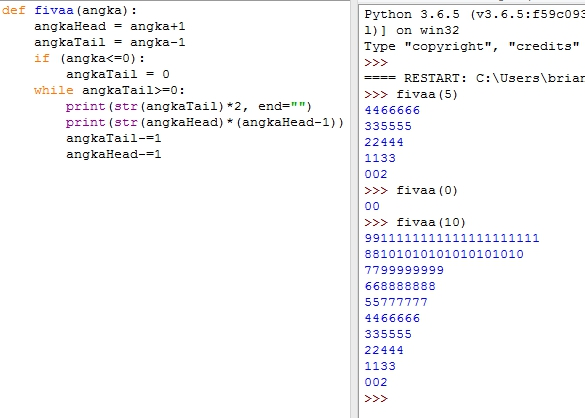

Fivaa

## Getting Started

This is a simple function of fivaa(int) that gives output :

`fivaa(5)`

```
4466666
335555
22444
1133
002
 ```

Before starting, you will need:

- Python 3.5 above
you can download here : https://www.python.org/downloads/
set pip and PATH to environment variables when installation


## How to run the program :

- Use python IDLE, and press F5 for run module, or

- Use CMD, go to directory file you have cloned or downloaded, then open cmd in same directory

For example using `Windows + R` : "C:\Users\brian.estadimas\Downloads\fivaa\" then type `python fivaa.py`


## You can open source code with notepad++ or sublime

Testing function :


